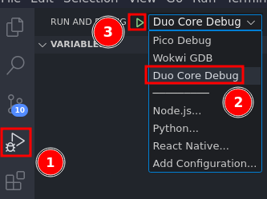

# sample_rm_pico_app

This repo is a template repo to set up develpment for [pi pico](https://www.raspberrypi.com/documentation/microcontrollers/raspberry-pi-pico.html) to 
work in the [robomasters](https://robomasters-website.web.app/) competition.  
[official robomasters page](https://www.robomaster.com/en-US)


It uses the [rm_pico_dev](https://github.com/agmui/rm_pico_dev) library

# Setup Guide

## Linux(ubuntu)

This will take a while and needs sudo

### WARNING DO NOT UPDATE RECURSIVELY

<details>
<summary>why tho?</summary>
There are some submodules that may go on for a while (like tinyusb) and I highly
recommend you don't need to get them.
If you want to see what submodules I update just look in `linux_init.sh`

</details>

```bash
git clone https://github.com/agmui/sample_rm_pico_app.git
cd sample_rm_pico_app
./linux_init.sh && source ~/.bashrc
```

Next install: [vscode](https://code.visualstudio.com/Download)  
go on to [vscode section](#vscode-extensions)

## Windows

download and run: [rm-pico-installer](https://github.com/agmui/rm-pico-setup-windows/releases/download/v1.0.0-alpha/pico-setup-windows-x64-standalone.exe)

It automatically installs all the tools and vscode.

Next go on to [vscode section](#vscode-extensions)

### WSL

follow the linux guide but currently some methods do not work (also ur kinda on ur own hehe)

TODO: make separate guide for vscode section

## Mac

<details>
<summary>might not work lol</summary>

`brew install libusb pkg-config`

Next install: [vscode](https://code.visualstudio.com/Download)  
go on to [vscode section](#vscode-extensions)
</details>

## vscode extensions

install vscode  
Have vscode open this repo
When first opining vscode should ask you to install the plugins  


If not just type `@recommended` here  


## Uploading

Make sure the pico is pluged in

#### Method 1

> Note: This method assumes you installed all the recommend plugins from the [vscode section](#vscode-extensions)  

Step1:  
select kit


Step2:  
press `CTRL + SHIFT + B`  

Step3:
select the usb port the pico is plugged in it should look like this:  
  
then hit start monitoring

<details>
<summary>if no show up</summary>
is the pico plugged in  
if not re press `CTRL + SHIFT + B`
</details>

### BIG NOTE: If the pico bricks you cant just use `CTRL + SHIFT + B` you have to reset it or do Method 2
please go to [I borked my pico](#I borked my pico) section for more

#### Method 2

```bash
mkdir build
cd build
cmake ..
make -j4
picotool load -f pico_app.uf2
```

#### If all else fails

<details>
<summary>Method 3</summary>

```bash
mkdir build
cd build
cmake ..
make -j4
```

unplug the pico  
Hold the bootsel button on the pico  
  
while still holding the button plug the pico back in

A usb stick should pop up in your file explorer  
TODO: add pic

drag and drop the `pico_app.u2f` file in the build folder


</details>

## Debugging

Wire up two picos like this  


upload this file
[pico-debug.uf2](https://github.com/essele/pico_debug/releases/tag/v0.3)
to the left pico in the picture using any method from [above](#uploading)

Next select the right debugger and run  


You can also open serial monitor if you want bc uart is passed through

> side note: I don't use picoprobe or openocd. I use this for those who care
[pico_debug](https://github.com/essele/pico_debug/tree/v0.3)

### Don't have a second pico?

Just upload this file:
[pico-debug-gimmecache.uf2](https://github.com/majbthrd/pico-debug/releases/download/v10.05/pico-debug-gimmecache.uf2)

Then choose Duo_Core_Debug  


github: [pico-debug](https://github.com/majbthrd/pico-debug)

### NOTE!!!  HAVING `stdio_init_all()` IN YOUR CODE WILL CRASH THIS DEBUGGER
## Running in [Wokwi](https://wokwi.com/) 👀

No pico no problem! We can just simulate it 🤯

### Step1

press `CTRL + SHIFT + P` and type `Wokwi: Request a new License`


its going to ask to open a webpage  


click get you license and make an account  


this should pop up when it works  


### Step2

do `Ctrl + SHIFT + P` again  
type `Wokwi: Start Simulator and Wait for Debugger`
  

<details>
<summary>Select a Kit?</summary>

if it asks to select kit  
choose arm as kit  


</details>  

### Step3

Next select the right debugger and run  


then open up `main.cpp` to add breakpoints

to set up any wiring go here and copy the `diagram.json` when done [pico wokwi](https://wokwi.com/projects/new/pi-pico)

## Building

Method 1:  
Just press `f7` if you installed all [plugins](#vscode-extensions)

Method 2:

```bash
mkdir build
cd build
cmake ..
make -j4
```

## I borked my pico

slides install guide: https://docs.google.com/presentation/d/1am9qFasZtjAnBu1M_k-8S4nNLxHHzSmExr1Sa2NGVAE/edit?usp=sharing

TODO:
* linux reaload udev rules
* have tools.json be able to load examples
* fix picotool bug where on reboot if in bootsel state u cant use picotool
* write rm_pico extension to have ctrl+shift+t run wokwi tests